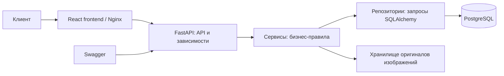
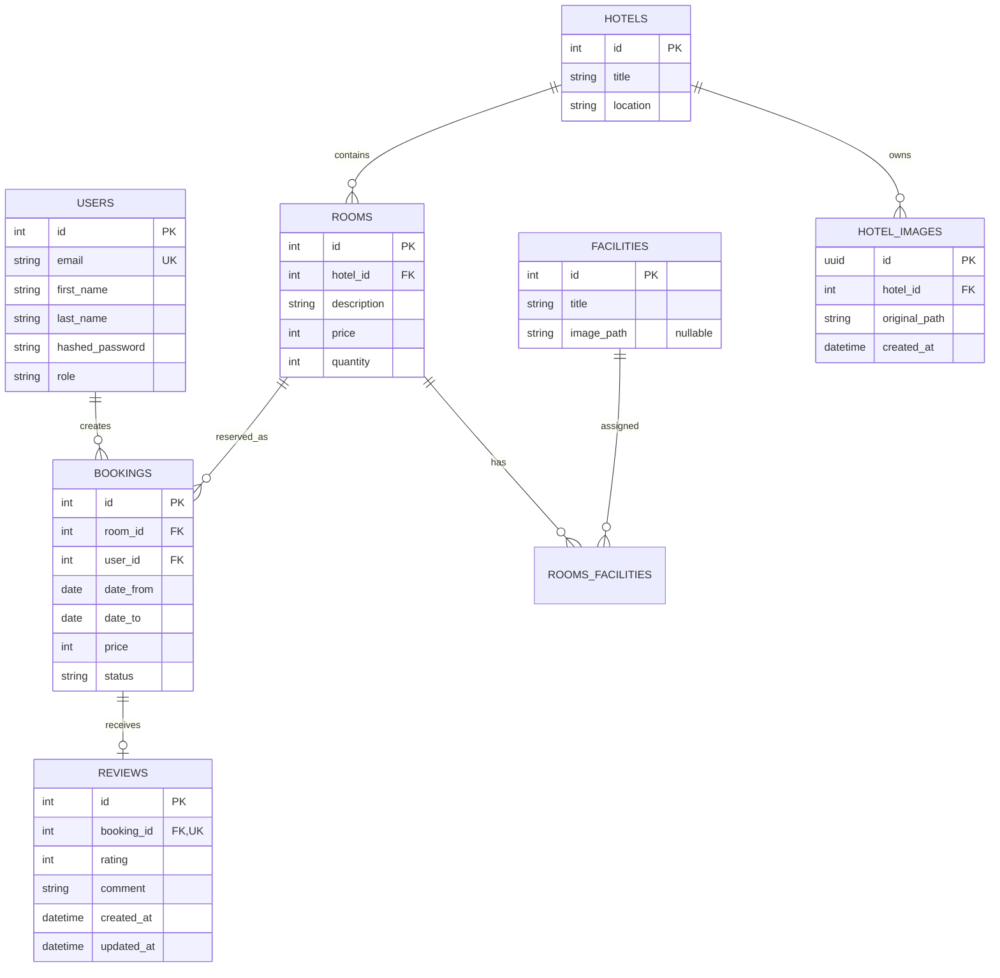

# EasyBook — онлайн-сервис бронирования отелей

EasyBook — полнофункциональный курсовой проект по базам данных с современным
React-интерфейсом. Система хранит каталог отелей, типов номеров и удобств,
позволяет клиентам искать и бронировать номера, а администраторам — управлять
каталогом и видеть все бронирования.

## Возможности

- регистрация и cookie-аутентификация по JWT;
- роли `client` и `admin`;
- поиск доступных отелей и номеров по датам;
- глобальные подсказки городов через Geoapify;
- защищённое от параллельных запросов бронирование;
- отмена без удаления истории;
- отзывы владельцев после завершения подтверждённого проживания;
- безопасная загрузка изображений JPEG/PNG/WebP до 5 МБ, включая иконки
  удобств строго 38×38 пикселей;
- адаптивный frontend на React 19, Vite 6 и поддерживаемом vanilla CSS;
- светлая и тёмная темы интерфейса с учётом системного предпочтения и сохранением
  ручного выбора в браузере;
- PostgreSQL и Alembic;
- Swagger по адресу `/docs`, healthcheck-и `/health/live` и `/health/ready`.

## Архитектура



Frontend отвечает за клиентский сценарий поиска, выбора номера, авторизации и
трёхшагового оформления бронирования: данные гостя, демонстрационная форма оплаты
без платёжного шлюза и подтверждение реальной брони. API отвечает за HTTP-контракт и права, сервисы — за
бизнес-правила и транзакции, репозитории — за работу с БД. Оригиналы
изображений хранятся в отдельном каталоге, а их метаданные — в PostgreSQL.
Фотографии отелей сохраняются в `src/static/images/hotels/{hotel_id}`, а
иконки удобств — в `src/static/images/facilities/{facility_id}`.
Docker Compose монтирует `src/static/images` в API-контейнер напрямую, поэтому
добавленные локально файлы сразу доступны по публичному пути `/static/images/...`.

## Модель данных



Ключевые ограничения БД: `price >= 0`, `quantity > 0`,
`date_from < date_to`, `rating BETWEEN 1 AND 5`, один отзыв на бронь и
уникальная пара удобства и номера. Удаление отеля,
номера или пользователя с бронями запрещено (`409`), связи удобств удаляются
каскадно.

`rooms` представляет типы номеров, а не отдельные физические комнаты. Каждый
тип номера имеет обязательное непустое описание длиной до 500 символов. Оно
возвращается как в списке доступных типов номера отеля, так и в ответе одного
типа номера.

Отзыв создаёт только владелец подтверждённой брони начиная с даты выезда.
Комментарий обязателен и содержит не более 2000 символов. Отзыв можно изменять
и удалять; после удаления для той же брони его можно создать снова. Бронь с
существующим отзывом отменить нельзя.

## Защита от овербукинга

Интервалы полуоткрытые: `[date_from, date_to)`, поэтому выезд и следующий
заезд в один день совместимы. Создание брони выполняется одной транзакцией:

1. строка типа номера блокируется `SELECT ... FOR UPDATE`;
2. считаются пересекающиеся брони со статусом `confirmed`;
3. результат сравнивается с `rooms.quantity`;
4. бронь создаётся либо возвращается `409 room_unavailable`.

Конкурентные запросы к одному типу номера сериализуются этой блокировкой. Это
исключает ситуацию, когда два клиента одновременно увидели последний номер
свободным. Цена копируется в бронь и не меняется при последующем обновлении
каталога.

## Запуск через Docker Compose

```bash
cp .env.example .env
# замените JWT_SECRET_KEY на случайную строку длиной не менее 32 символов
docker compose up --build
```

Compose запускает PostgreSQL, API и frontend в режиме `LOCAL`. Пользовательский интерфейс
доступен на `http://localhost:3000`, API — на `http://localhost:8000`, Swagger —
на `http://localhost:8000/docs`. Миграции
выполняются перед стартом Uvicorn; при ошибке контейнер API останавливается.
После миграций API автоматически создаёт локальные демонстрационные данные.
Compose имеет отдельный известный локальный JWT-ключ, чтобы `docker compose config`
и первый запуск были воспроизводимы без `.env`. В `MODE=PROD` приложение отвергает
этот ключ и любой ключ короче 32 символов, а cookie всегда получает флаг `Secure`.

Чтобы включить глобальные подсказки городов, создайте ключ в Geoapify и укажите
`GEOAPIFY_API_KEY=<ваш-ключ>` в локальном `.env`. Ключ используется только API,
не передаётся браузеру и не должен попадать в Git. Без ключа остальной каталог
работает как обычно, а подсказки не отображаются.

Создание или повышение администратора (команда идемпотентна):

```bash
docker compose exec api python -m src.cli create-admin --email admin@example.com --first-name Алексей --last-name Смирнов
```

Для повторного ручного наполнения БД выполните:

```bash
docker compose exec api python -m src.cli seed-demo
```

Если API-контейнер был создан до появления команды, сначала пересоберите его:

```bash
docker compose up -d --build api
```

В контейнере должен быть установлен `MODE=LOCAL` или `MODE=DEV`. Для разового
локального запуска без пересоздания контейнера режим можно явно передать только
CLI-процессу:

```bash
docker compose exec -e MODE=LOCAL api python -m src.cli seed-demo
```

Команда идемпотентна и создаёт 156 отелей в восьми
направлениях: Москва (30), Санкт-Петербург (24), Сочи (18), Байкал (10),
Казань (16), Калининград (12), Мальдивы (20) и Стамбул (26). У каждого отеля
есть три типа номеров с описанием-абзацем, завершённая и будущая подтверждённые
брони, отменённая бронь и один отзыв, поэтому каталог и аналитика заполнены
сразу после запуска.
Первый запуск не требует доступа к интернету: локальный каталог содержит
реальные названия отелей в каждом направлении и поэтому не зависит от
доступности OpenStreetMap. Если нужно отдельно импортировать фотографии из
Wikimedia Commons, передайте
`IMPORT_REMOTE_DEMO_CATALOG=true`; импортированные данные и атрибуция кэшируются
в `src/static/images/_demo_cache` и `src/static/images/demo-image-attribution.json`.
Автоматическое
наполнение выполняется только при `MODE=LOCAL` или `MODE=DEV`; при `MODE=PROD`
команда и автозапуск отключены.

Тестовые учётные записи:

- `admin@example.com` / `12345678` — администратор;
- `client@example.com` / `12345678` — клиент;
- `traveler@example.com` / `12345678` — клиент.

При повторном запуске записи не дублируются, а освобождённые идентификаторы демо-отелей,
номеров, бронирований и отзывов используются повторно. Sequence сбрасываются к максимальному
ID сохранённых пользовательских записей, поэтому пользовательские данные не удаляются. Команда предназначена только для
`LOCAL`, `DEV` и `TEST` и отказывается работать при `MODE=PROD`.

### Локальная разработка frontend

Для отдельного запуска интерфейса нужен Node.js 22 и pnpm:

```bash
cd frontend
pnpm install
pnpm dev
```

Vite публикует приложение на `http://localhost:5173` и проксирует `/api` и
`/static` на локальный FastAPI по адресу `http://localhost:8000`. Перед
завершением frontend-изменений выполняйте:

```bash
pnpm test
pnpm lint
pnpm build
```

Frontend — одностраничное JavaScript/React-приложение с маршрутизацией через
History API и
URL-маршрутами для главной, серверной выдачи отелей, страницы отеля,
авторизации, бронирования, личного кабинета и административной панели.
Интерфейс использует редакционную дизайн-систему на Geist, адаптивную сетку и
CSS-переходы с поддержкой `prefers-reduced-motion`; формы, таблицы и критические
действия от анимации не зависят.
Клиентская роль управляет своими бронями и отзывами. Администратор управляет
отелями, номерами, удобствами и изображениями, просматривает и отменяет все
брони, строит аналитику и проверяет health endpoint-ы. Создание и редактирование
административных сущностей выполняются одной формой для каждого типа данных без
дублирования PUT/PATCH как отдельных пользовательских действий.
`frontend/src/App.jsx` отвечает за состояние сессии, загрузку данных и
маршрутизацию. Общая навигация находится в `frontend/src/components`, страницы —
в `frontend/src/pages`, независимые экраны административной панели — в
`frontend/src/pages/admin`, а стили — в `frontend/src/styles`. Единый API-клиент
находится в `frontend/src/api.js`; он
поддерживает JSON, `multipart/form-data`, cookie-сессию и общий формат ошибок.
Интерфейс не подставляет демонстрационные сущности, цены или рейтинги при пустом
ответе либо ошибке backend. Статические фотографии из `frontend/public/images`
используются только как оформление и fallback до загрузки администратором
backend-изображений конкретного отеля.

Для локальной разработки установите зависимости и примените миграции:

```bash
python -m pip install -r requirements-dev.txt
alembic upgrade head
uvicorn src.main:app
```

## Основные endpoint-ы

| Метод и путь | Доступ | Назначение |
|---|---|---|
| `POST /auth/register`, `/auth/login`, `/auth/logout` | все | учётная запись с обязательными именем и фамилией, сессия |
| `GET/PUT /auth/me` | пользователь | чтение и обновление собственного профиля |
| `GET /hotels` | все | доступные отели, пагинация |
| `GET /hotels/admin`, `GET /hotels/{id}/rooms/admin` | admin | полный каталог, включая ещё недоступные позиции |
| `GET /locations/suggestions?q=...` | все | до 10 подсказок мировых городов в формате «Город, Страна» |
| mutations `/hotels`, `/hotels/{id}/rooms`, `/facilities` | admin | управление каталогом, включая изменение удобств |
| `POST /bookings` | пользователь | создать бронь |
| `GET /bookings/me` | пользователь | свои брони с `hotel_id` для перехода к отелю |
| `GET /bookings/{id}` | владелец/admin | одна бронь |
| `POST /bookings/{id}/cancel` | владелец/admin | идемпотентная отмена до даты заезда |
| `GET /bookings` | admin | все брони, пагинация |
| `GET /analytics/hotels` | admin | аналитика по отелям, период, пагинация и сортировка |
| `GET/POST/PUT/DELETE /users...` | admin | управление пользователями и ролями |
| `POST /reviews` | владелец брони | создать отзыв после даты выезда |
| `GET /reviews/me`, `GET/PATCH/DELETE /reviews/{id}` | владелец | свои отзывы |
| `GET /hotels/{id}/reviews` | все | публичные отзывы, пагинация |
| `POST/PUT/DELETE /hotels/{id}/images/...` | admin | загрузка, замена и удаление изображений |
| `PUT/DELETE /facilities/{id}/image` | admin | загрузка, замена и удаление иконки удобства 38×38 |

Списки отелей, административных броней, публичных отзывов и аналитика по отелям имеют вид
`{"items": [], "total": 0, "page": 1, "per_page": 10}`.

Эти списки поддерживают параметры `sort_by` и `sort_order=asc|desc`:

- отели: `sort_by=id|title|location`, по умолчанию `id asc`;
- бронирования: `sort_by=id|date_from|date_to|price|status`, по умолчанию `id asc`;
- отзывы: `sort_by=created_at|rating`, по умолчанию `created_at desc`.
- аналитика: `sort_by=hotel_id|hotel_title|confirmed_bookings|cancelled_bookings|booked_revenue|booked_nights|average_rating|cancellation_rate`, по умолчанию `hotel_id asc`.

Если значения основного поля совпадают, порядок стабилизируется по `id`, а для
аналитики — по `hotel_id` в том же направлении. Каждый параметр можно передавать
отдельно; неизвестные значения возвращают `422`.

`GET /analytics/hotels` возвращает строку для каждого существующего отеля с
числом подтверждённых и отменённых броней, расчётной выручкой по подтверждённым
ночам, количеством таких ночей, средней оценкой и процентом отмен. Необязательные
`date_from` и `date_to` передаются только вместе и задают полуоткрытый период
проживания `[date_from, date_to)`; без них используется вся история. Для броней,
пересекающих границу периода, выручка и ночи учитываются только внутри периода.
Средняя оценка относится к периоду по дате выезда, а при отсутствии отзывов
равна `null`. Отели без активности не исключаются из результата.

## Ошибки

Ошибки бизнес-логики имеют единый формат
`{"code": "machine_readable_code", "detail": "Описание"}`.

| HTTP | Значение |
|---|---|
| `400/422` | некорректные даты или входные данные |
| `401` | токен отсутствует, повреждён или истёк |
| `403` | недостаточно прав |
| `404` | объект отсутствует |
| `409` | номер занят, отзыв недоступен или нарушена целостность данных |
| `413` | изображение больше 5 МБ |
| `429` | превышен лимит регистрации/входа |

Для отзывов используются коды `review_already_exists`, `review_not_allowed`,
`booking_has_review` и `review_not_found`.
Для иконок удобств используются коды `facility_image_not_found`,
`image_validation_error` и `invalid_facility_image_dimensions`. Публичная схема
удобства содержит `image_url`, равный `null`, пока иконка не загружена.
Попытка отменить подтверждённую бронь в день заезда или позже возвращает
`409 booking_cancellation_closed`; повторная отмена уже отменённой брони остаётся
идемпотентной.

## Тесты и миграции

Обычный запуск `pytest` автоматически создаёт временный PostgreSQL-контейнер;
unit-тесты не требуют БД. Нужен работающий Docker:

```bash
ruff check .
pyright
pytest
alembic check
```

Интеграционные тесты проверяют права, JWT, ограничения БД, соседние интервалы,
10 параллельных броней, конкурентное создание отзывов, замену файлов изображений,
административное управление пользователями, отмену, приватность и валидацию
изображений. Для
проверки истории миграций используются `alembic upgrade head` и
`alembic downgrade base` на отдельной БД.

## Границы проекта

В курсовую входят frontend, backend и БД. Платежи и настоящая email-рассылка не
реализуются. Для изображений сохраняются проверенный оригинал
и его метаданные; создание миниатюр и другая фоновая обработка не выполняются.
