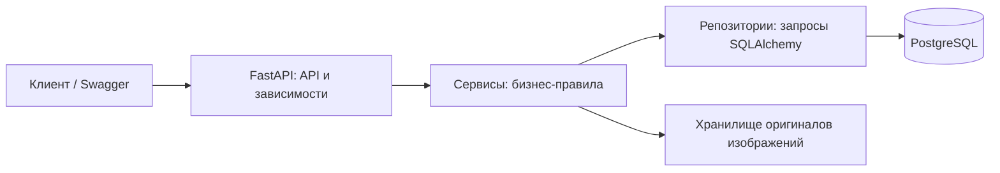

# EasyBook — онлайн-сервис бронирования отелей

EasyBook — backend курсового проекта по базам данных. Система хранит каталог
отелей, типов номеров и удобств, позволяет клиентам бронировать номера, а
администраторам — управлять каталогом и видеть все бронирования.

## Возможности

- регистрация и cookie-аутентификация по JWT;
- роли `client` и `admin`;
- поиск доступных отелей и номеров по датам;
- защищённое от параллельных запросов бронирование;
- отмена без удаления истории;
- отзывы владельцев после завершения подтверждённого проживания;
- безопасная загрузка изображений JPEG/PNG/WebP до 5 МБ;
- PostgreSQL и Alembic;
- Swagger по адресу `/docs`, healthcheck-и `/health/live` и `/health/ready`.

## Архитектура



API отвечает за HTTP-контракт и права, сервисы — за бизнес-правила и
транзакции, репозитории — за работу с БД. Оригиналы изображений хранятся в
отдельном каталоге, а их метаданные — в PostgreSQL.

## Модель данных

```mermaid
erDiagram
    USERS ||--o{ BOOKINGS : creates
    HOTELS ||--o{ ROOMS : contains
    ROOMS ||--o{ BOOKINGS : reserved_as
    BOOKINGS ||--o| REVIEWS : receives
    ROOMS ||--o{ ROOMS_FACILITIES : has
    FACILITIES ||--o{ ROOMS_FACILITIES : assigned
    HOTELS ||--o{ HOTEL_IMAGES : owns

    USERS { int id PK string email UK string hashed_password string role }
    HOTELS { int id PK string title string location }
    ROOMS { int id PK int hotel_id FK int price int quantity }
    BOOKINGS { int id PK int room_id FK int user_id FK date date_from date date_to int price string status }
    REVIEWS { int id PK int booking_id FK_UK int rating string comment datetime created_at datetime updated_at }
    FACILITIES { int id PK string title }
    HOTEL_IMAGES { uuid id PK int hotel_id FK string original_path datetime created_at }
```

Ключевые ограничения БД: `price >= 0`, `quantity > 0`,
`date_from < date_to`, `rating BETWEEN 1 AND 5`, один отзыв на бронь и
уникальная пара удобства и номера. Удаление отеля,
номера или пользователя с бронями запрещено (`409`), связи удобств удаляются
каскадно.

Отзыв создаёт только владелец подтверждённой брони начиная с даты выезда.
Комментарий обязателен и содержит не более 2000 символов. Отзыв можно изменять
и удалять; после удаления для той же брони его можно создать снова. Бронь с
существующим отзывом отменить нельзя.

## Защита от овербукинга

Интервалы полуоткрытые: `[date_from, date_to)`, поэтому выезд и следующий
заезд в один день совместимы. Создание брони выполняется одной транзакцией:

1. строка типа номера блокируется `SELECT ... FOR UPDATE`;
2. считаются пересекающиеся брони со статусом `confirmed`;
3. результат сравнивается с `rooms.quantity`;
4. бронь создаётся либо возвращается `409 room_unavailable`.

Конкурентные запросы к одному типу номера сериализуются этой блокировкой. Это
исключает ситуацию, когда два клиента одновременно увидели последний номер
свободным. Цена копируется в бронь и не меняется при последующем обновлении
каталога.

## Запуск через Docker Compose

```bash
cp .env.example .env
docker compose up --build
```

Compose запускает PostgreSQL и API. API доступен на
`http://localhost:8000`, Swagger — на `http://localhost:8000/docs`. Миграции
выполняются перед стартом Uvicorn; при ошибке контейнер API останавливается.

Создание или повышение администратора (команда идемпотентна):

```bash
docker compose exec api python -m src.cli create-admin --email admin@example.com
```

Для локальной разработки установите зависимости и примените миграции:

```bash
python -m pip install -r requirements-dev.txt
alembic upgrade head
uvicorn src.main:app
```

## Основные endpoint-ы

| Метод и путь | Доступ | Назначение |
|---|---|---|
| `POST /auth/register`, `/auth/login`, `/auth/logout` | все | учётная запись и сессия |
| `GET /auth/me` | пользователь | ID, email и роль |
| `GET /hotels` | все | доступные отели, пагинация |
| mutations `/hotels`, `/hotels/{id}/rooms`, `/facilities` | admin | управление каталогом |
| `POST /bookings` | пользователь | создать бронь |
| `GET /bookings/me` | пользователь | свои брони |
| `GET /bookings/{id}` | владелец/admin | одна бронь |
| `POST /bookings/{id}/cancel` | владелец/admin | идемпотентная отмена |
| `GET /bookings` | admin | все брони, пагинация |
| `POST /reviews` | владелец брони | создать отзыв после даты выезда |
| `GET /reviews/me`, `GET/PATCH/DELETE /reviews/{id}` | владелец | свои отзывы |
| `GET /hotels/{id}/reviews` | все | публичные отзывы, пагинация |
| `POST/DELETE /hotels/{id}/images/...` | admin | изображения |

Списки отелей, административных броней и публичных отзывов имеют вид
`{"items": [], "total": 0, "page": 1, "per_page": 10}`.

## Ошибки

Ошибки бизнес-логики имеют единый формат
`{"code": "machine_readable_code", "detail": "Описание"}`.

| HTTP | Значение |
|---|---|
| `400/422` | некорректные даты или входные данные |
| `401` | токен отсутствует, повреждён или истёк |
| `403` | недостаточно прав |
| `404` | объект отсутствует |
| `409` | номер занят, отзыв недоступен или нарушена целостность данных |
| `413` | изображение больше 5 МБ |
| `429` | превышен лимит регистрации/входа |

Для отзывов используются коды `review_already_exists`, `review_not_allowed`,
`booking_has_review` и `review_not_found`.

## Тесты и миграции

Обычный запуск `pytest` автоматически создаёт временный PostgreSQL-контейнер;
unit-тесты не требуют БД. Нужен работающий Docker:

```bash
ruff check .
pyright
pytest
alembic check
```

Интеграционные тесты проверяют права, JWT, ограничения БД, соседние интервалы,
10 параллельных броней, конкурентное создание отзывов, отмену, приватность и
валидацию изображений. Для
проверки истории миграций используются `alembic upgrade head` и
`alembic downgrade base` на отдельной БД.

## Границы проекта

В курсовую входят только backend и БД. Frontend, платежи и настоящая
email-рассылка не реализуются. Для изображений сохраняются проверенный оригинал
и его метаданные; создание миниатюр и другая фоновая обработка не выполняются.
