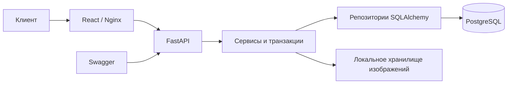
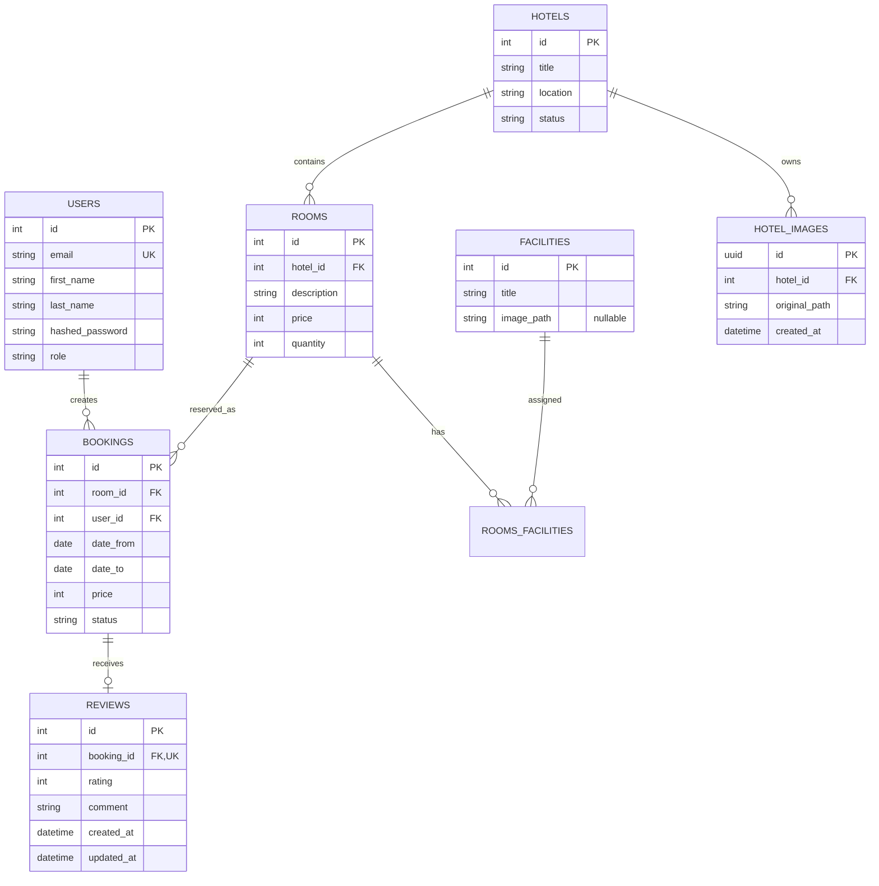

# EasyBook — онлайн-сервис бронирования отелей

EasyBook — курсовой проект по базам данных с React-интерфейсом и FastAPI API.
Пользователи могут искать и бронировать номера, управлять поездками и оставлять
отзывы. Администраторы управляют каталогом, пользователями и аналитикой.

## Возможности

- JWT-аутентификация через HttpOnly cookie и роли `client`/`admin`;
- поиск отелей по местоположению и датам;
- защищённое от конкурентных запросов бронирование;
- отмена бронирований без удаления истории;
- отзывы после завершённого проживания;
- управление отелями, типами номеров, удобствами и изображениями;
- архивирование отелей без удаления истории бронирований;
- аналитика по отелям с фильтрацией, сортировкой и пагинацией;
- светлая и тёмная темы;
- PostgreSQL, Alembic и воспроизводимый запуск через Docker Compose.

## Архитектура



Backend разделён на HTTP-маршруты, сервисы, репозитории, схемы и ORM-модели.
Frontend состоит из страниц, общих компонентов, API-клиента и отдельных файлов
стилей. Изображения хранятся в `src/static/images`, их метаданные — в PostgreSQL.

## Модель данных



Основные ограничения продублированы в Pydantic и PostgreSQL: цена неотрицательна,
количество номеров положительно, даты бронирования образуют корректный интервал,
email и связь отзыва с бронью уникальны.

## Защита от овербукинга

Бронирования используют полуоткрытые интервалы `[date_from, date_to)`. При
создании брони тип номера блокируется через `SELECT ... FOR UPDATE`, после чего в
той же транзакции проверяется число пересекающихся подтверждённых броней. Поэтому
при десяти параллельных запросах на последний номер успешным будет только один.
Уменьшение количества номеров также проверяет текущие и будущие подтверждённые
бронирования: если новый лимит ниже пика занятости, API возвращает
`409 room_quantity_below_bookings`.

## Быстрый запуск

```bash
cp .env.example .env
docker compose up --build
```

После запуска:

- frontend: `http://localhost:3000`;
- API: `http://localhost:8000`;
- Swagger: `http://localhost:8000/docs`.

Compose по умолчанию использует `MODE=LOCAL`, применяет миграции и создаёт
демонстрационный каталог. Для подсказок городов добавьте в `.env` ключ
`GEOAPIFY_API_KEY`. Cookie авторизации всегда получает флаг `Secure`.
Задайте собственный случайный `JWT_SECRET_KEY`: приложение не проверяет его
надёжность при запуске.

### Демонстрационные данные

Повторно наполнить локальную базу можно командой:

```bash
docker compose exec api python -m src.cli seed-demo
```

Демонстрационные учётные записи:

- `admin@example.com` / `12345678`;
- `client@example.com` / `12345678`;
- `traveler@example.com` / `12345678`.

Seed доступен только в режимах `LOCAL`, `DEV` и `TEST`, работает идемпотентно и
не удаляет пользовательские записи.

Seed использует 156 локальных фотографий из `src/static/images/demo` и не
обращается к сети. Он сразу регистрирует эти файлы в базе — дополнительные копии
не создаются. Для галереи каждого демо-отеля регистрируются три разные фотографии
из того же региона. Карточки типов номеров используют отдельные фотографии
интерфейса. Сведения об авторах и лицензиях находятся в
`src/static/images/demo/manifest.json`; после запуска также формируется
`src/static/images/demo-image-attribution.json` с привязкой фото к демо-отелям.
Фотография демо-отеля не обязательно показывает именно названный отель.
`frontend/public/images` содержит только оформление интерфейса и запасную
картинку для отеля без фотографии в API.

## Локальная разработка

Backend использует Python 3.13:

```bash
python -m pip install -r requirements.txt
alembic upgrade head
uvicorn src.main:app
```

Frontend использует Node.js 22 и pnpm:

```bash
cd frontend
pnpm install
pnpm dev
```

Vite запускается на `http://localhost:5173` и проксирует `/api` и `/static` на
FastAPI.

## Основные endpoint-ы

| Метод и путь | Доступ | Назначение |
|---|---|---|
| `POST /auth/register`, `/auth/login`, `/auth/logout` | все | регистрация и сессия |
| `GET/PUT /auth/me` | пользователь | профиль текущего пользователя |
| `GET /hotels` | все | поиск и пагинация отелей |
| `GET /hotels/{id}/rooms` | все | доступные типы номеров |
| `PATCH /hotels/{id}/status` | admin | установить `active` или `archived` |
| `GET /locations/suggestions` | все | подсказки городов через Geoapify |
| `POST /bookings` | пользователь | создание бронирования |
| `GET /bookings/me` | пользователь | собственные бронирования |
| `POST /bookings/{id}/cancel` | владелец/admin | отмена бронирования |
| `GET/POST/PATCH/DELETE /reviews...` | пользователь | управление отзывами |
| `GET /hotels/{id}/reviews` | все | публичные отзывы отеля |
| `GET /analytics/hotels` | admin | аналитика по отелям |
| mutations `/hotels`, `/rooms`, `/facilities`, `/users` | admin | управление данными |
| routes `/hotels/{id}/images`, `/facilities/{id}/image` | admin | управление изображениями |

Архивные отели отсутствуют в публичном поиске и не принимают новые бронирования
(`409 hotel_archived`). Их карточки доступны по прямой ссылке, а прежние брони,
отзывы и аналитика сохраняются. Административный список поддерживает фильтр
`status=active|archived`. Повторный локальный seed сохраняет статус демо-отелей.

В поиске `GET /hotels` метка местоположения «Город, Страна» также находит
отели, у которых сохранено только точное название города.

Пагинированные списки имеют формат `{items, total, page, per_page}`. Ошибки API
возвращаются единообразно:

```json
{"code": "machine_readable_code", "detail": "Описание ошибки"}
```

## Проверки

```bash
ruff check .
pyright
pytest
docker compose config --quiet
cd frontend
pnpm test
pnpm lint
pnpm build
```

Интеграционные тесты используют Testcontainers и требуют запущенный Docker
Desktop. CI дополнительно собирает Compose-проект и проверяет готовность API и БД.

## Границы проекта

Проект не выполняет реальные платежи и не отправляет email. Платёжная форма в
сценарии бронирования демонстрационная. Изображения сохраняются как проверенные
оригиналы без фоновой обработки и создания миниатюр.
